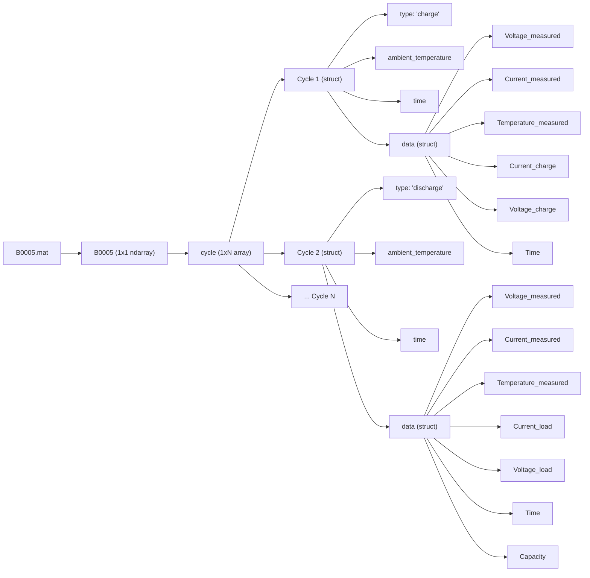

# Battery Dataset Reference

This document consolidates the information from all `README_*.txt` files in `Battery_DataSet`.

It is organized as:
- One **common data structure** section (shared across all groups)
- One **group-specific data description** section for each README battery group

---

## Common Data Structure (Shared Across All README TXT Files)

### Visual Data Structure Diagram
Here is a visual representation of how the data is nested inside a typical battery `.mat` file (e.g., `B0005.mat`), matching the exploration in the EDA notebook.

### Top-level
- `cycle`: top-level structure array containing the charge discharge, and impedance operations
  - `type`: operation type (`charge`, `discharge`, or `impedance`)
  - `ambient_temperature`: ambient temperature (deg C)
  - `time`: date and time of the start of the cycle (MATLAB date vector format)
  - `data`: structure containing measurements

### `data` fields for `charge`
- `Voltage_measured`: battery terminal voltage (Volts)
- `Current_measured`: battery output current (Amps)
- `Temperature_measured`: battery temperature (deg C)
- `Current_charge`: current measured at charger (Amps)
- `Voltage_charge`: voltage measured at charger (Volts)
- `Time`: time vector for the cycle (secs)

### `data` fields for `discharge`
- `Voltage_measured`: battery terminal voltage (Volts)
- `Current_measured`: battery output current (Amps)
- `Temperature_measured`: battery temperature (deg C)
- `Current_charge`: current measured at load (Amps)
- `Voltage_charge`: voltage measured at load (Volts)
- `Time`: time vector for the cycle (secs)
- `Capacity`: battery capacity (Ahr) for discharge till 2.7V

### `data` fields for `impedance`
- `Sense_current`: current in sense branch (Amps)
- `Battery_current`: current in battery branch (Amps)
- `Current_ratio`: ratio of the above currents
- `Battery_impedance`: battery impedance (Ohms) computed from raw data
- `Rectified_impedance`: calibrated and smoothed battery impedance (Ohms)
- `Re`: estimated electrolyte resistance (Ohms)
- `Rct`: estimated charge transfer resistance (Ohms)

---

## Group-Specific Data Descriptions

### Group 05/06/07/18
- Source: `README_05_06_07_18.txt`
- Batteries: `B0005`, `B0006`, `B0007`, `B0018`
- Profiles: charge, discharge, impedance
- Ambient condition: room temperature
- Charge protocol: CC at 1.5A to 4.2V, then CV to 20mA
- Discharge protocol: CC at 2A
- Discharge cutoffs:
  - B0005: 2.7V
  - B0006: 2.5V
  - B0007: 2.2V
  - B0018: 2.5V
- Impedance protocol: Electrochemical impedance spectroscopy (EIS) sweep 0.1Hz to 5kHz
- End condition: stopped at EOL defined as 30% capacity fade (2.0Ahr to 1.4Ahr)
- Notes: intended for remaining charge and RUL prediction

### Group 25/26/27/28
- Source: `README_25_26_27_28.txt`
- Batteries: `B0025`, `B0026`, `B0027`, `B0028`
- Profiles: charge, discharge, impedance
- Ambient condition: room temperature (24 deg C)
- Charge protocol: CC at 1.5A to 4.2V, then CV to 20mA
- Discharge protocol: 0.05Hz square wave load, 4A amplitude, 50% duty cycle
- Discharge cutoffs:
  - B0025: 2.0V
  - B0026: 2.2V
  - B0027: 2.5V
  - B0028: 2.7V
- Impedance protocol: EIS sweep 0.1Hz to 5kHz

### Group 29/30/31/32
- Source: `README_29_30_31_32.txt`
- Batteries: `B0029`, `B0030`, `B0031`, `B0032`
- Profiles: charge, discharge, impedance
- Ambient condition: elevated temperature (43 deg C)
- Charge protocol: CC at 1.5A to 4.2V, then CV to 20mA
- Discharge protocol: fixed 4A
- Discharge cutoffs:
  - B0029: 2.0V
  - B0030: 2.2V
  - B0031: 2.5V
  - B0032: 2.7V
- Impedance protocol: EIS sweep 0.1Hz to 5kHz

### Group 33/34/36
- Source: `README_33_34_36.txt`
- Batteries: `B0033`, `B0034`, `B0036`
- Profiles: charge, discharge, impedance
- Ambient condition: room temperature (24 deg C)
- Charge protocol: CC at 1.5A to 4.2V, then CV to 20mA
- Discharge protocol:
  - B0033: 4A to 2.0V
  - B0034: 4A to 2.2V
  - B0036: 2A to 2.7V
- Impedance protocol: EIS sweep 0.1Hz to 5kHz
- End condition: stopped at 1.6Ahr (20% fade)

### Group 38/39/40
- Source: `README_38_39_40.txt`
- Batteries: `B0038`, `B0039`, `B0040`
- Profiles: charge, discharge, impedance
- Ambient condition: multiple temperatures (24 and 44 deg C)
- Charge protocol: CC at 1.5A to 4.2V, then CV to 20mA
- Discharge protocol: multiple load levels (1A, 2A, 4A)
- Discharge cutoffs:
  - B0038: 2.2V
  - B0039: 2.5V
  - B0040: 2.7V
- Impedance protocol: EIS sweep 0.1Hz to 5kHz
- End condition: stopped at 1.6Ahr (20% fade)

### Group 41/42/43/44
- Source: `README_41_42_43_44.txt`
- Batteries: `B0041`, `B0042`, `B0043`, `B0044`
- Profiles: charge, discharge, impedance
- Ambient condition: 4 deg C
- Charge protocol: CC at 1.5A to 4.2V, then CV to 20mA
- Discharge protocol: fixed loads of 4A and 1A
- Discharge cutoffs:
  - B0041: 2.0V
  - B0042: 2.2V
  - B0043: 2.5V
  - B0044: 2.7V
- Impedance protocol: EIS sweep 0.1Hz to 5kHz
- End condition: stopped at 1.4Ahr (30% fade)
- Notes: some discharge runs show very low capacity; reasons not fully analyzed

### Group 45/46/47/48
- Source: `README_45_46_47_48.txt`
- Batteries: `B0045`, `B0046`, `B0047`, `B0048`
- Profiles: charge, discharge, impedance
- Ambient condition: 4 deg C
- Charge protocol: CC at 1.5A to 4.2V, then CV to 20mA
- Discharge protocol: fixed 1A load
- Discharge cutoffs:
  - B0045: 2.0V
  - B0046: 2.2V
  - B0047: 2.5V
  - B0048: 2.7V
- Impedance protocol: EIS sweep 0.1Hz to 5kHz
- End condition: stopped at 1.4Ahr (30% fade)
- Notes: some discharge runs show very low capacity; reasons not fully analyzed

### Group 49/50/51/52
- Source: `README_49_50_51_52.txt`
- Batteries: `B0049`, `B0050`, `B0051`, `B0052`
- Profiles: charge, discharge, impedance
- Ambient condition: 4 deg C
- Charge protocol: CC at 1.5A to 4.2V, then CV to 20mA
- Discharge protocol: fixed 2A load
- Discharge cutoffs:
  - B0049: 2.0V
  - B0050: 2.2V
  - B0051: 2.5V
  - B0052: 2.7V
- Impedance protocol: EIS sweep 0.1Hz to 5kHz
- End condition: stopped when experiment control software crashed
- Notes: several runs have very low capacity and voltage; reasons not fully analyzed

### Group 53/54/55/56
- Source: `README_53_54_55_56.txt`
- Batteries: `B0053`, `B0054`, `B0055`, `B0056`
- Profiles: charge, discharge, impedance
- Ambient condition: 4 deg C
- Charge protocol: CC at 1.5A to 4.2V, then CV to 20mA
- Discharge protocol: fixed 2A load
- Discharge cutoffs:
  - B0053: 2.0V
  - B0054: 2.2V
  - B0055: 2.5V
  - B0056: 2.7V
- Impedance protocol: EIS sweep 0.1Hz to 5kHz
- End condition: stopped at 1.4Ahr (30% fade)
- Notes: some discharge runs show very low capacity; reasons not fully analyzed

---

## Source Files Covered
- `Battery_DataSet/README_05_06_07_18.txt`
- `Battery_DataSet/README_25_26_27_28.txt`
- `Battery_DataSet/README_29_30_31_32.txt`
- `Battery_DataSet/README_33_34_36.txt`
- `Battery_DataSet/README_38_39_40.txt`
- `Battery_DataSet/README_41_42_43_44.txt`
- `Battery_DataSet/README_45_46_47_48.txt`
- `Battery_DataSet/README_49_50_51_52.txt`
- `Battery_DataSet/README_53_54_55_56.txt`
